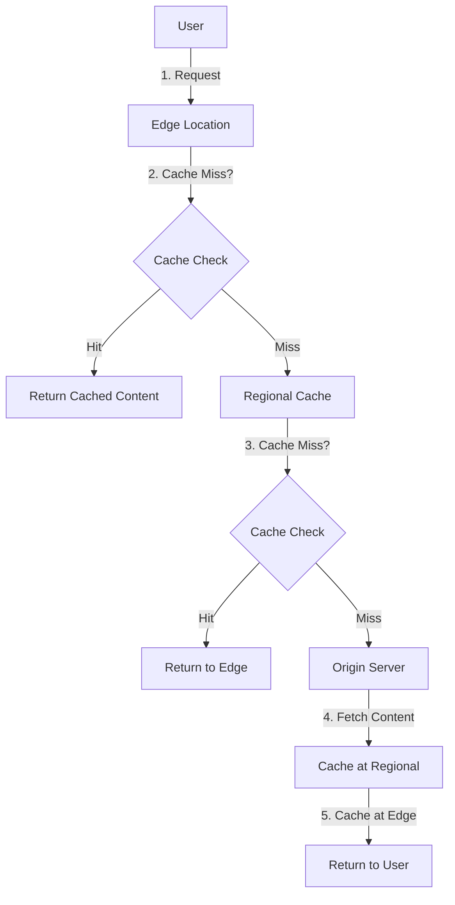

# Amazon CloudFront

!!! info "このページについて"
    Amazon CloudFrontの概要とCDN（Content Delivery Network）の仕組みについて解説します。実際の設定手順は[セットアップガイド](setup.md)を、活用事例は[ユースケース](use-cases.md)をご覧ください。

## CloudFrontとは

Amazon CloudFrontは、AWS提供の**グローバルCDN（Content Delivery Network）サービス**です。世界中に配置されたエッジロケーションを通じて、ユーザーに最も近い場所からコンテンツを配信することで、高速化と可用性向上を実現します。

### 主な特徴

- **グローバル配信**: 世界600+のエッジロケーション
- **高性能**: ミリ秒レベルのレスポンス時間
- **セキュリティ**: DDoS攻撃保護、WAF連携
- **柔軟な設定**: 多様なキャッシュポリシー
- **コスト効率**: 従量課金制

!!! tip "CDNの効果"
    CDNを使用することで、東京からアメリカのユーザーへの配信でも、現地エッジロケーションからの配信により大幅な高速化が可能です。

## 基本的な仕組み

### エッジロケーション

世界中に配置されたキャッシュサーバー群で、主要な配置場所：

**アジア太平洋**
- 東京、大阪、ソウル、香港、シンガポール、シドニー、ムンバイ等

**北米**
- ニューヨーク、ロサンゼルス、シアトル、シカゴ、マイアミ等

**欧州**
- ロンドン、フランクフルト、パリ、アムステルダム、ストックホルム等

### 配信フロー



1. **ユーザーリクエスト**: 最寄りのエッジロケーションにルーティング
2. **エッジキャッシュ確認**: コンテンツがキャッシュされているかチェック
3. **リージョナルキャッシュ確認**: エッジにない場合、リージョナルキャッシュをチェック
4. **オリジン取得**: キャッシュにない場合、オリジンサーバーから取得
5. **キャッシュ保存**: 各レベルでキャッシュを保存し、次回リクエストを高速化

## 主要コンポーネント

### ディストリビューション

CloudFrontの設定単位で、以下の要素を含みます：

- **オリジン**: コンテンツの元となるサーバー
- **ビヘイビア**: URLパスごとの配信ルール
- **キャッシュポリシー**: キャッシュの保持期間や条件

### オリジンタイプ

#### 1. S3オリジン
```
example.com/static/* → S3バケット
example.com/images/* → S3バケット（別バケット）
```

#### 2. カスタムオリジン
```
example.com/api/* → ALB（EC2）
example.com/app/* → EC2インスタンス
example.com/ → オンプレミス
```

### キャッシュポリシー

#### マネージドポリシー（AWS提供）

| ポリシー名 | 用途 | TTL | クエリ文字列 |
|------------|------|-----|-------------|
| Managed-CachingOptimized | 静的コンテンツ | 1日 | 無視 |
| Managed-CachingOptimizedForUncompressedObjects | 圧縮無効 | 1日 | 無視 |
| Managed-CachingDisabled | 動的コンテンツ | なし | すべて転送 |

#### カスタムポリシー例

```json
{
    "Id": "custom-static-cache",
    "Name": "StaticContentCaching",
    "DefaultTTL": 86400,
    "MaxTTL": 31536000,
    "MinTTL": 1,
    "ParametersInCacheKeyAndForwardedToOrigin": {
        "EnableAcceptEncodingGzip": true,
        "EnableAcceptEncodingBrotli": true,
        "QueryStringsConfig": {
            "QueryStringBehavior": "none"
        },
        "HeadersConfig": {
            "HeaderBehavior": "none"
        },
        "CookiesConfig": {
            "CookieBehavior": "none"
        }
    }
}
```

## 料金体系

### 2025年現在の料金（目安）

#### データ転送料金（アジア太平洋）

| データ転送量 | 料金（USD/GB） |
|-------------|----------------|
| 最初の1TB/月 | $0.140 |
| 次の9TB/月 | $0.120 |
| 次の40TB/月 | $0.105 |
| 次の100TB/月 | $0.080 |
| 150TB以上/月 | $0.060 |

#### リクエスト料金

| リクエストタイプ | 料金（USD/10,000リクエスト） |
|------------------|----------------------------|
| HTTP/HTTPS GET | $0.0075 |
| HTTP/HTTPS POST/PUT/PATCH/DELETE | $0.0100 |

#### 追加機能料金

| 機能 | 料金 |
|------|------|
| 専用IPアドレス（SSL証明書用） | $600/月 |
| リアルタイムログ | $0.01/100万ログ行 |
| CloudFront Functions | $0.10/100万実行 |
| Lambda@Edge | Lambda料金 + $0.20/100万実行 |

!!! warning "料金の注意点"
    - 上記は目安価格です。最新の料金は[AWS公式ページ](https://aws.amazon.com/cloudfront/pricing/)をご確認ください
    - 地域によって料金が異なります
    - 無料枠：毎月1TBのデータ転送、1,000万回のHTTPSリクエスト（12ヶ月間）

### コスト最適化のポイント

1. **キャッシュ戦略の最適化**: 長期キャッシュでオリジンへのリクエスト削減
2. **圧縮の有効化**: データ転送量の削減
3. **適切なプライスクラス**: 必要な地域のみで配信
4. **オリジンシールド**: 中間キャッシュでオリジン負荷軽減

## ユースケース概要

### 1. 静的サイト高速化
- HTML、CSS、JavaScript、画像の配信
- S3との組み合わせ
- グローバル展開時の必須要素

### 2. 動的コンテンツ高速化
- API レスポンスの地理的最適化
- TCP最適化による高速化
- エッジでのデータ圧縮

### 3. メディア配信
- 動画・音声ストリーミング
- HLS、DASH形式対応
- 大容量ファイル配信

### 4. セキュリティ強化
- DDoS攻撃からの保護
- WAF（Web Application Firewall）連携
- 地理的制限（ジオブロッキング）

### 5. APIのグローバル最適化
- RESTful API の高速化
- GraphQL エンドポイント
- WebSocket通信の最適化

## CloudFrontとその他CDNとの比較

| 機能 | CloudFront | Cloudflare | Fastly |
|------|------------|------------|--------|
| エッジロケーション数 | 600+ | 320+ | 100+ |
| 最小TTL | 1秒 | 2時間（無料） | 1秒 |
| エッジコンピューティング | ✓ | ✓ | ✓ |
| リアルタイム設定変更 | △ | ✓ | ✓ |
| AWS統合 | ✓ | △ | △ |
| 無料枠 | 1TB/月（12ヶ月） | 無制限（制限あり） | 50GB/月 |

!!! tip "CloudFront選択の理由"
    - **AWS統合**: S3、ALB、EC2との密な連携
    - **セキュリティ**: Shield、WAFとの統合
    - **運用負荷軽減**: AWS統一コンソール
    - **企業レベル**: 99.99%のSLA保証

## 設定の階層構造

### ディストリビューション設定
```
Distribution (example.com)
├── Origin Settings
│   ├── S3: my-bucket.s3.amazonaws.com
│   └── Custom: api.example.com
├── Cache Behaviors
│   ├── /api/* → Custom Origin (No Cache)
│   ├── /static/* → S3 Origin (1年キャッシュ)
│   └── /* → S3 Origin (1日キャッシュ)
├── Error Pages
│   ├── 404 → /404.html
│   └── 500 → /error.html
└── Security
    ├── SSL Certificate
    ├── HTTPS Redirect
    └── Geographic Restrictions
```

## パフォーマンス指標

### 主要メトリクス

- **Origin Latency**: オリジンサーバーのレスポンス時間
- **Cache Hit Ratio**: キャッシュヒット率（理想値：90%以上）
- **Error Rate**: エラー発生率（4xx、5xx）
- **Origin Load**: オリジンサーバーへの負荷

### 監視ツール

- **CloudWatch**: 基本メトリクス（無料）
- **Real-time Logs**: 詳細なアクセスログ（有料）
- **CloudWatch RUM**: フロントエンドパフォーマンス監視

!!! info "次のステップ"
    - [セットアップガイド](setup.md): CloudFrontディストリビューションの作成から詳細設定まで
    - [ユースケース](use-cases.md): 具体的な活用事例とベストプラクティス
    - [S3連携](../s3/use-cases.md#cloudfront連携): S3との効果的な組み合わせ

## 関連リンク

- [AWS CloudFront 公式ドキュメント](https://docs.aws.amazon.com/cloudfront/)
- [CloudFront 料金](https://aws.amazon.com/cloudfront/pricing/)
- [CloudFront デベロッパーガイド](https://docs.aws.amazon.com/AmazonCloudFront/latest/DeveloperGuide/)