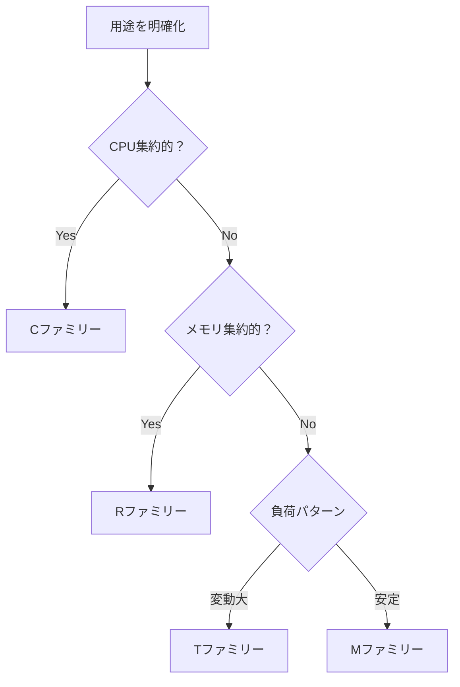

# 🖥️ Amazon EC2概要

Amazon Elastic Compute Cloud（EC2）は、AWSのコア的な仮想サーバーサービスです。スケーラブルで柔軟なクラウドコンピューティング環境を提供します。

## EC2とは

EC2は「Elastic Compute Cloud」の略で、以下の特徴を持つ仮想サーバーサービスです：

- **仮想化**: 物理サーバーを仮想分割した仮想マシン
- **弾性（Elastic）**: 需要に応じてスケールアップ・ダウン可能
- **従量課金**: 使用した分だけ課金
- **多様な選択肢**: 豊富なインスタンスタイプとOS

### 基本概念

| 用語 | 説明 |
|------|------|
| **インスタンス** | EC2で起動される仮想サーバー |
| **AMI** | Amazon Machine Image（OSやソフトウェアのテンプレート） |
| **インスタンスタイプ** | CPU、メモリ、ストレージ、ネットワーク性能の組み合わせ |
| **EBS** | Elastic Block Store（永続的ブロックストレージ） |
| **セキュリティグループ** | 仮想ファイアウォール |
| **キーペア** | SSH接続用の公開鍵・秘密鍵ペア |

## インスタンスタイプの選び方

EC2には100以上のインスタンスタイプがあります。主要ファミリーを理解して最適な選択をしましょう。

### 汎用（General Purpose）

#### Tファミリー - バーストパフォーマンス
- **特徴**: CPU使用量が少ない時にクレジットを蓄積、必要時にバーストパフォーマンス
- **用途**: 軽量なWebサーバー、開発環境、小規模データベース
- **モデル**: t4g、t3、t3a、t2

```bash
# T3インスタンス例
t3.nano    - 2vCPU、0.5GB RAM  - 月額約$3.5
t3.micro   - 2vCPU、1GB RAM    - 月額約$7.0 (無料枠対象)
t3.small   - 2vCPU、2GB RAM    - 月額約$14
t3.medium  - 2vCPU、4GB RAM    - 月額約$28
```

!!! tip "T系の特徴"
    通常のCPU使用率が低い（30%以下）アプリケーションに最適。クレジット残量はCloudWatchで監視可能。

#### Mファミリー - バランス型
- **特徴**: CPU、メモリ、ネットワークのバランスが良い定常パフォーマンス
- **用途**: Webサーバー、企業アプリケーション、バックエンドサーバー
- **モデル**: m6i、m6a、m5、m5a

```bash
# M5インスタンス例
m5.large   - 2vCPU、8GB RAM    - 月額約$70
m5.xlarge  - 4vCPU、16GB RAM   - 月額約$140
m5.2xlarge - 8vCPU、32GB RAM   - 月額約$280
```

### コンピューティング最適化（Compute Optimized）

#### Cファミリー - CPU集約型
- **特徴**: 高性能CPU、CPU集約的な処理に特化
- **用途**: Webサーバー、科学的モデリング、バッチ処理、分散分析
- **モデル**: c6i、c6a、c5、c5n

```bash
# C5インスタンス例
c5.large   - 2vCPU、4GB RAM    - 月額約$63
c5.xlarge  - 4vCPU、8GB RAM    - 月額約$125
c5.2xlarge - 8vCPU、16GB RAM   - 月額約$250
```

### メモリ最適化（Memory Optimized）

#### Rファミリー - メモリ集約型
- **特徴**: 大容量メモリ、メモリ集約的な処理に最適
- **用途**: インメモリデータベース、リアルタイム分析、高性能データベース
- **モデル**: r6i、r6a、r5、r5a

```bash
# R5インスタンス例
r5.large   - 2vCPU、16GB RAM   - 月額約$87
r5.xlarge  - 4vCPU、32GB RAM   - 月額約$175
r5.2xlarge - 8vCPU、64GB RAM   - 月額約$350
```

#### Xファミリー - 超高メモリ
- **特徴**: 最大4TBの大容量メモリ
- **用途**: SAP HANA、Apache Spark、高性能データベース
- **注意**: 非常に高価格

### ストレージ最適化（Storage Optimized）

#### I系ファミリー - 高速I/O
- **特徴**: NVMe SSDローカルストレージ、高IOPS
- **用途**: NoSQL データベース、分散ファイルシステム、高頻度I/O

### アクセラレーテッドコンピューティング

#### P系ファミリー - GPU（機械学習）
- **用途**: 機械学習、HPC、科学計算

#### G系ファミリー - GPU（グラフィックス）
- **用途**: グラフィックスワークステーション、ゲームストリーミング

### 選択指針



!!! note "インスタンスタイプの変更"
    EBS-backedインスタンスなら停止後にインスタンスタイプを変更可能。最初は小さく始めて調整しましょう。

## 料金モデル

### オンデマンド
```bash
# 時間単位の課金
- 前払い不要
- 最低利用期間なし
- 開発・テスト・短期利用に最適
- 最も高い単価
```

### Savings Plans（推奨）
```bash
# 1〜3年のコミット割引
- 最大72%の割引
- インスタンスファミリー、サイズ、AZ、リージョン、OS、テナンシーの変更可能
- 柔軟性とコスト削減のバランス
```

### リザーブドインスタンス
```bash
# 1〜3年の予約割引
- 最大75%の割引
- 特定のインスタンスタイプに固定
- 安定したワークロードに最適
```

### スポットインスタンス
```bash
# 余剰キャパシティの活用
- 最大90%の割引
- 2分前通知で中断される可能性
- バッチ処理、フォルトトレラントな処理に最適
```

### 料金例（ap-northeast-1、Linux）

| インスタンスタイプ | オンデマンド/時間 | 月額概算 | Savings Plans（3年） |
|------------------|-----------------|----------|-------------------|
| t3.micro | $0.0116 | $8.5 | $5.7 (33%削減) |
| t3.small | $0.0232 | $17 | $11 (35%削減) |
| m5.large | $0.1088 | $79 | $52 (34%削減) |
| c5.large | $0.0944 | $69 | $44 (36%削減) |
| r5.large | $0.1424 | $104 | $67 (36%削減) |

!!! tip "料金最適化"
    混合利用が効果的：ベースロードは Savings Plans、変動部分はオンデマンド、バッチ処理はスポットを組み合わせ。

## リージョン・アベイラビリティゾーン（AZ）

### リージョン
- **定義**: 地理的に分離されたデータセンター群
- **選択基準**:
  - レイテンシ（ユーザーからの距離）
  - 法規制・コンプライアンス
  - 利用可能サービス
  - 料金

### 主要リージョン

| リージョン | コード | 特徴 |
|-----------|--------|------|
| **東京** | ap-northeast-1 | 日本語サポート、低レイテンシ |
| **大阪** | ap-northeast-3 | 災害対策、東京のバックアップ |
| **ソウル** | ap-northeast-2 | 近隣、料金が安い |
| **シンガポール** | ap-southeast-1 | ASEAN展開の拠点 |
| **バージニア北部** | us-east-1 | 最多サービス、安価 |
| **オレゴン** | us-west-2 | 安価、新サービス早期提供 |

### アベイラビリティゾーン（AZ）
```bash
# 東京リージョンの例
ap-northeast-1a
ap-northeast-1c  
ap-northeast-1d

# 特徴
- 各リージョン内に複数のAZ（通常3つ以上）
- 物理的に分離された施設
- 高速専用線で接続
- 災害対策・高可用性の基盤
```

### 高可用性設計

```bash
# マルチAZ配置の例
Web Tier:    ALB (Multi-AZ)
App Tier:    EC2 (AZ-1a, 1c)
DB Tier:     RDS Multi-AZ (1a→1c)
```

!!! warning "AZ間通信"
    異なるAZ間のデータ転送は課金対象（$0.01/GB）。設計時に考慮が必要です。

## 次のステップ

EC2の基本を理解したら、以下に進みましょう：

1. **[セットアップガイド](setup.md)** - 実際にインスタンスを作成
2. **[活用事例](use-cases.md)** - 実践的な使用パターン
3. **[セキュリティ](security.md)** - セキュリティのベストプラクティス

## パフォーマンス監視

CloudWatchで監視すべき主要メトリクス：

```bash
# CPU使用率
CPUUtilization

# ネットワーク
NetworkIn/NetworkOut

# ディスクI/O  
DiskReadOps/DiskWriteOps

# メモリ（カスタムメトリクス）
MemoryUtilization

# クレジット残高（T系のみ）
CPUCreditBalance
```

!!! tip "監視のポイント"
    メトリクスに基づいてインスタンスタイプを適切にサイズ調整。過剰スペックは無駄なコスト、不足スペックは性能問題を引き起こします。