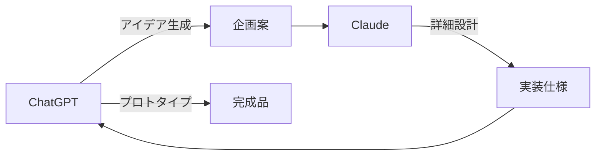

# ChatGPT vs Claude 使い分けガイド

ChatGPTとClaudeの特徴を理解して、適切なAIを選択しましょう。

!!! info "両方使うのがベスト"
    どちらが優れているかではなく、**タスクに応じて使い分ける**ことが重要です。それぞれの特徴を活かせば、AIの効果を最大化できます。

## 🎯 基本的な特徴比較

### ChatGPT（OpenAI）
- **幅広い用途**: マルチモーダル対応（テキスト・画像・音声）
- **素早い応答**: 即座の回答とコード生成
- **豊富な機能**: プラグイン、カスタムGPT、GPTストア
- **統合性**: 多くのツールとの連携が簡単
- **創造性**: 画像生成（DALL·E）、動画（Sora）

### Claude（Anthropic）
- **深い思考**: 構造化された論理的な回答
- **長文処理**: 最大200K+トークン（ChatGPTの約6倍）
- **安全性**: 慎重で倫理的な応答
- **品質重視**: 人間らしい自然な文章
- **コード品質**: 丁寧な説明付きの高品質コード

!!! tip "簡単な選び方"
    - **速さと多機能**: ChatGPT
    - **品質と深さ**: Claude

## 📊 タスク別おすすめ

### 🚀 ChatGPTが得意なタスク

| 分野 | 理由 | 具体例 |
|------|------|--------|
| **アイデア出し** | 創造性と発想力 | ブレインストーミング、企画立案 |
| **マルチメディア** | 画像・音声対応 | プレゼン資料作成、イラスト生成 |
| **プロトタイピング** | 素早いコード生成 | MVP開発、API作成 |
| **自動化** | 豊富な連携機能 | Zapier連携、ワークフロー構築 |
| **カスタマーサポート** | プラグイン活用 | チャットボット、FAQ応答 |

### 🧠 Claudeが得意なタスク

| 分野 | 理由 | 具体例 |
|------|------|--------|
| **長文分析** | 大きなコンテキスト | 論文要約、契約書レビュー |
| **複雑なコーディング** | 構造化思考 | アーキテクチャ設計、リファクタリング |
| **技術文書作成** | 論理的な文章 | API仕様書、開発ガイド |
| **データ分析** | 深い洞察 | レポート作成、統計分析 |
| **研究・調査** | 慎重な検証 | 文献調査、事実確認 |

!!! warning "注意点"
    どちらも日々進化しています。最新の機能や性能は公式サイトで確認してください。

## 💰 料金比較（2025年）

### 個人向けプラン

| プラン | ChatGPT Plus | Claude Pro |
|--------|--------------|------------|
| **月額** | $20 | $20（年払いで$17/月） |
| **主な機能** | GPT-4o、音声機能、カスタムGPT | Claude 3 Opus/Sonnet/Haiku、Artifacts |
| **使用制限** | 月40メッセージ（GPT-4o） | 使用量ベース |
| **特典** | 優先アクセス | プロジェクト機能、ツール連携 |

### API料金

!!! info "トークンベース課金"
    どちらもAPI使用量に応じた従量課金制。大量処理なら事前にコストを計算しましょう。

- **ChatGPT API**: 幅広い価格帯、GPT-4o-mini は低コスト
- **Claude API**: 高品質重視、Opus > Sonnet > Haiku の順

## 🔄 連携ワークフロー例

### パターン1: アイデア → 実装

1. **ChatGPT**: ブレインストーミングでアイデア生成
2. **Claude**: アイデアを詳細に分析・設計
3. **ChatGPT**: 素早くプロトタイプ作成

### パターン2: 文書作成 → レビュー

1. **ChatGPT**: 素早く初稿を作成
2. **Claude**: 論理性や文章品質を向上

### パターン3: 調査 → 企画

1. **Claude**: 情報を深く分析・整理
2. **ChatGPT**: 分析結果から具体的な提案を作成

!!! tip "実践的な使い分け"
    - **朝の企画**: ChatGPTでアイデア出し
    - **午後の作業**: Claudeで詳細設計・実装
    - **夜のレビュー**: 両方で品質チェック

## 🛠️ 開発者向け比較

### コーディング支援

| 項目 | ChatGPT | Claude |
|------|---------|---------|
| **コード生成速度** | ⭐⭐⭐⭐⭐ | ⭐⭐⭐⭐ |
| **コード品質** | ⭐⭐⭐⭐ | ⭐⭐⭐⭐⭐ |
| **デバッグ支援** | ⭐⭐⭐⭐ | ⭐⭐⭐⭐⭐ |
| **説明の丁寧さ** | ⭐⭐⭐ | ⭐⭐⭐⭐⭐ |
| **大規模コード対応** | ⭐⭐⭐ | ⭐⭐⭐⭐⭐ |

### IDE・エディタ連携

!!! example "人気の組み合わせ"
    - **Cursor**: Claude統合でコーディング
    - **GitHub Copilot**: ChatGPTベースの補完
    - **VSCode**: 両方のエクステンション利用可能

## 🎨 クリエイティブ作業比較

### 文章作成

| 用途 | 推奨AI | 理由 |
|------|-------|------|
| **ブログ記事** | ChatGPT | 素早い執筆、SEO最適化 |
| **技術記事** | Claude | 論理的構造、正確性 |
| **創作小説** | ChatGPT | 想像力、ストーリー展開 |
| **学術論文** | Claude | 厳密性、引用の正確性 |
| **マーケティングコピー** | ChatGPT | キャッチー、感情的訴求 |

### マルチメディア

!!! success "ChatGPTの独占領域"
    - **画像生成**: DALL·E 3統合
    - **音声対話**: Voice Mode
    - **動画作成**: Sora（限定公開）

## 📈 ビジネス活用シーン

### スタートアップ・小規模チーム

**ChatGPT推奨**
- 幅広いタスクを1つのツールで
- プロトタイプ作成が高速
- 外部ツールとの連携が豊富

### 企業・大規模開発

**Claude推奨**
- 高品質なアウトプットが重要
- セキュリティ・コンプライアンス重視
- 長期的なコード保守性

!!! info "セキュリティ考慮"
    機密情報を扱う場合は、両社のプライバシーポリシーとデータ取り扱いを確認してください。

## 🚀 最新動向（2025年）

### ChatGPTの新機能
- **GPT-5**: さらなる性能向上
- **Operator**: 自律的なタスク実行エージェント
- **Sora**: 高品質動画生成（段階的公開）

### Claudeの新機能
- **Claude Sonnet 4.5**: 推論能力強化
- **Claude Code**: 開発特化モード
- **MCP対応**: ツール連携拡張

!!! note "継続的な進化"
    AI分野は急速に進歩しています。定期的に最新情報をチェックし、使い分け戦略を見直しましょう。

## ✅ まとめ: どちらを選ぶべきか

### ChatGPTを選ぶべき人
- **多様なタスク**を1つのツールで処理したい
- **素早い結果**が欲しい
- **創造的な作業**が多い
- **ツール連携**を重視する
- **コスト効率**を重視する

### Claudeを選ぶべき人
- **高品質なアウトプット**が必要
- **長文・複雑な内容**を扱う
- **論理的思考**を重視する
- **セキュリティ**が重要
- **深い分析**が必要

### 両方使いこなすには

!!! tip "効果的な使い分け"
    1. **タスクの性質**を理解する
    2. **それぞれの強み**を活かす
    3. **連携ワークフロー**を構築する
    4. **定期的に見直し**をする

最終的には、あなたの作業スタイルと要求に最も適したAIを選択することが重要です。可能であれば両方試してみて、実際の使用感で判断することをおすすめします。