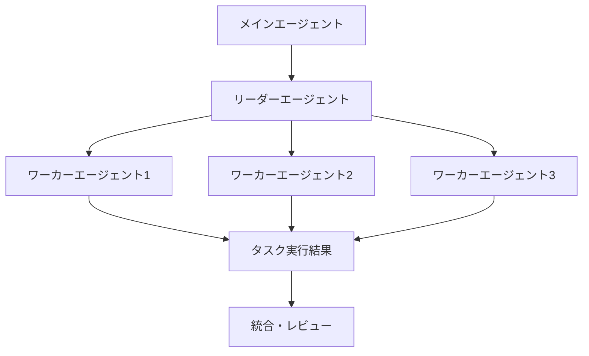

# Claude Cowork活用ガイド

Claude Coworkは、複数のエージェントが協調して複雑なタスクを自律実行する革新的な機能です。
従来の一問一答形式を超え、PC上で実際の作業を代行してくれる「AIの同僚」として機能します。

## Coworkとは

!!! note "概要"
    Coworkは、Claude Codeと同じエージェンティックアーキテクチャを活用し、ターミナルを使わずにClaude Desktopから直接利用できる機能です。単一の応答ではなく、複数ステップにわたる複雑なタスクを自律的に実行します。

### 主な特徴

- **マルチエージェント協調機能**: 複数の独立したエージェントが連携してタスクを進行
- **自律実行**: ユーザーが目標を設定すれば、Claude が自動的に計画・実行
- **PC統合**: ローカルファイルへの直接アクセスと編集が可能
- **リアルタイム監視**: 作業進捗の確認と途中での方向修正が可能

## バックグラウンドエージェントの仕組み

### Agent Teams アーキテクチャ



1. **リーダーエージェント**: タスク全体の計画と分担を管理
2. **ワーカーエージェント**: 個別のサブタスクを並列実行
3. **協調メカニズム**: エージェント間の情報共有とタスク調整

### 実行環境

!!! warning "セキュリティ"
    Coworkは仮想マシン（VM）上で実行され、安全に隔離された環境でコードを動かします。ただし、選択したファイルには実際の変更を加える可能性があります。

## 並列タスク実行

### 並列実行の利点

- **効率性**: 複数の調査や分析を同時進行
- **多角的視点**: 異なる観点からの並列レビュー
- **スケーラビリティ**: 大規模プロジェクトの分割実行

### 実際の並列例

```
タスク: 市場調査レポート作成
├── エージェント1: 競合他社分析
├── エージェント2: 顧客インタビュー分析  
├── エージェント3: 統計データ収集
└── リーダー: 最終統合と報告書作成
```

## 使い方・設定方法

### 利用要件

!!! info "対応プラン"
    - **有料プラン必須**: Pro、Max、Team、Enterprise
    - **対応OS**: Windows、macOS、Linux
    - **注意**: Windows arm64 は非対応

### 初期設定

1. **Claude Desktop最新版をダウンロード**
   ```bash
   # 公式サイトから最新版を取得
   https://claude.com/download
   ```

2. **Cowork機能の有効化**
   - Claude Desktop起動後、左側パネルから「Cowork」を選択
   - 初回起動時は自動でワークスペースがセットアップされます

3. **フォルダアクセス権限の設定**
   - 作業対象フォルダを選択
   - ファイル読み書き権限を許可

### グローバル指示の設定

```
設定例:
- トーン: 専門的かつ分かりやすく
- 出力形式: Markdown形式で構造化
- 言語: 日本語優先
- 作業スタイル: 詳細な進捗報告を含む
```

## 実用的なユースケース

### 1. リサーチの並列化

!!! example "市場調査の自動化"
    **タスク**: 新サービスの市場可能性調査
    
    **並列実行内容**:
    - エージェント1: 業界レポート収集・分析
    - エージェント2: 競合サービス機能比較
    - エージェント3: SNS上のニーズ調査
    - エージェント4: 法規制・制約の確認

### 2. コード生成の並列化

```python
# プロジェクト例: Webアプリケーション開発
# 並列実行:
# ├── フロントエンド開発 (React)
# ├── バックエンドAPI開発 (FastAPI)  
# ├── データベース設計 (PostgreSQL)
# └── テストコード作成 (pytest)
```

### 3. データ分析の並列化

!!! tip "分析効率の向上"
    **大規模データセット分析**:
    
    - **前処理**: データクリーニングと標準化
    - **探索分析**: 統計的概要と可視化
    - **機械学習**: モデル学習と評価
    - **レポート作成**: 結果解釈と提案

### 4. ドキュメント作成

```
企業研修資料作成例:
├── スライド作成 (PowerPoint)
├── 配布資料作成 (PDF)
├── 演習問題作成 (Word)
└── 評価シート作成 (Excel)
```

## プラグインによるカスタマイズ

### 利用可能なプラグイン

- **Research & Analysis**: 調査・分析業務に特化
- **Document Creation**: 文書作成とフォーマット
- **Data Processing**: データ処理と可視化
- **Project Management**: プロジェクト管理支援

### カスタムプラグイン作成

```javascript
// プラグイン設定例
{
  "name": "custom-research-plugin",
  "skills": ["web-search", "document-analysis"],
  "connectors": ["google-scholar", "pubmed"],
  "commands": ["/research", "/summarize", "/cite"]
}
```

## 制限事項・注意点

### 現在の制限

!!! warning "技術的制限"
    - **プレビュー機能**: 安定性や機能に制約あり
    - **使用量消費**: 通常のチャットよりも大幅に多い
    - **ネットワーク接続**: 安定した環境が必要
    - **ファイルサイズ**: 大容量ファイルの処理に時間がかかる可能性

### セキュリティ考慮事項

```
推奨設定:
├── 重要ファイルのバックアップ
├── 作業フォルダの明確な分離
├── 機密情報を含むファイルのアクセス制限
└── 定期的な作業内容の確認
```

### パフォーマンス最適化

!!! tip "効率的な利用方法"
    - **明確なタスク定義**: 具体的な目標と期待結果を明示
    - **適切なスコープ**: 過度に複雑なタスクは分割
    - **リソース管理**: 使用量制限を意識した計画
    - **進捗監視**: 長時間実行時の定期チェック

## トラブルシューティング

### よくある問題と解決策

| 問題 | 原因 | 解決方法 |
|------|------|----------|
| タスクが途中で停止 | アプリ終了・スリープ | Claude Desktop を開いたまま維持 |
| 使用量制限に到達 | 複雑なタスクの連続実行 | 簡単なタスクは通常チャットを利用 |
| ファイルが見つからない | アクセス権限不足 | フォルダ権限とパスを確認 |

!!! info "サポート"
    問題が解決しない場合は、Claude Desktop内のフィードバック機能を使用して Anthropic チームに報告できます。

---

*最終更新: 2026年2月12日*