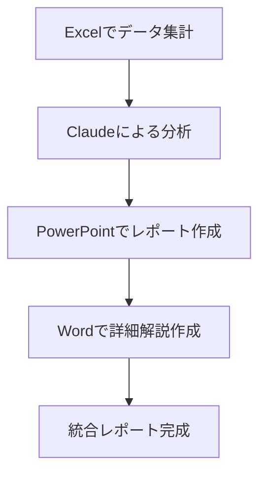

# Claude × Microsoft Office連携ガイド

ClaudeとMicrosoft Officeの連携により、Excel、PowerPoint、Wordでの作業を劇的に効率化できます。
AI支援によるデータ分析、プレゼンテーション作成、文書編集が可能になります。

## 概要

!!! note "Microsoft Office Agent Mode"
    MicrosoftはOffice Agent ModeでClaude AIをWord、Excel、PowerPointに統合しています。この機能により、自然言語での指示でOffice文書の作成・編集が可能になりました。

### 主要機能

- **Office Agent Mode**: Excel・Word内での直接AI支援
- **Copilot Office Agent**: PowerPoint・Word文書の会話型作成
- **ファイル作成機能**: Claude経由での各種Office文書生成
- **Skills機能**: 特定業務向けの専用スキルセット

## Claude in Excel

### データ分析機能

!!! example "Excelでできること"
    - **自動データクリーニング**: 不整合データの検出と修正
    - **関数生成**: 複雑な数式の自動作成
    - **グラフ作成**: データに最適な可視化の提案
    - **統計分析**: 記述統計から高度な分析まで
    - **財務モデル**: 収益計算やリスク分析モデル

### 実用例

```excel
指示例: "売上データから月次トレンドを分析し、来期の予測グラフを作成して"

実行内容:
1. データの前処理（欠損値処理、外れ値検出）
2. 時系列分析とトレンド抽出
3. 予測モデルの構築（移動平均、指数平滑化等）
4. 視覚的に分かりやすいグラフ作成
5. 結果の解釈とコメント追加
```

### 高度な活用例

#### 財務分析ダッシュボード
```
作成内容:
├── KPI指標の自動計算
├── 動的グラフとチャート
├── 条件付き書式による視覚化
└── マクロによる更新自動化
```

#### 在庫管理システム
```sql
-- Excelと連携したSQLクエリ生成例
SELECT 
    product_name,
    current_stock,
    reorder_point,
    CASE 
        WHEN current_stock < reorder_point THEN '発注必要'
        ELSE '在庫十分'
    END as status
FROM inventory
ORDER BY current_stock ASC;
```

## Claude in PowerPoint

### プレゼンテーション生成機能

!!! tip "Office Agentの活用"
    「アスレジャー市場トレンドを要約したデッキを作成して」のような指示で、自動的にウェブ調査を行い、洗練されたPowerPointを生成できます。

### 主要機能

- **テーマ自動選択**: 内容に適したデザインテーマの提案
- **レイアウト最適化**: 情報の重要度に応じたスライド構成
- **グラフィック生成**: データを視覚化するチャートやダイアグラム
- **コンテンツリサーチ**: 関連情報の自動収集と整理

### 作成フロー例


### 実用的な活用例

#### 1. ビジネス提案資料

!!! example "営業プレゼン自動生成"
    **入力**: 「新サービスの営業提案資料を作成。競合比較と ROI 分析を含む」
    
    **出力**:
    - エグゼクティブサマリー
    - 市場分析と競合比較
    - サービス概要と差別化ポイント
    - 導入効果とROI試算
    - 実装スケジュール
    - Q&A想定問答

#### 2. 研修・教育資料

```
教育プレゼンの構成例:
├── 学習目標の明示
├── 理論解説（図解付き）
├── 実践演習スライド
├── ケーススタディ分析
└── 振り返りとアクションプラン
```

#### 3. レポート発表資料

```python
# データ分析結果のプレゼン自動化
analysis_results = {
    "key_findings": ["売上20%向上", "顧客満足度85%"],
    "recommendations": ["A施策の継続", "B領域の強化"],
    "next_steps": ["追加調査", "実装計画"]
}

# → 自動でPowerPointスライド生成
```

## Claude in Word（一部機能）

### 文書作成支援

!!! info "現在の機能"
    WordでのClaude統合は発展途上ですが、Office Agent経由でWord文書の生成が可能です。

- **長文作成**: レポートや論文の構成と執筆
- **文書校正**: 文法チェックと表現改善
- **フォーマット調整**: 見出しや目次の自動生成
- **翻訳・要約**: 多言語対応と内容要約

### 活用例

#### 技術文書作成
```
指示: "API仕様書を作成。エンドポイント一覧と使用例を含む"

生成内容:
├── 概要説明
├── 認証方法
├── エンドポイント詳細
├── リクエスト/レスポンス例
├── エラーハンドリング
└── SDKサンプルコード
```

## セットアップ方法

### 1. 基本セットアップ（Office Agent Mode）

!!! warning "前提条件"
    - Microsoft 365サブスクリプション
    - Claude Pro/Max/Team/Enterpriseプラン
    - 最新版のOfficeアプリケーション

```
設定手順:
1. Microsoft 365にサインイン
2. Office Agent Mode機能を有効化
3. Anthropic Claude アカウント連携
4. アプリケーション権限の許可
```

### 2. MCP（Model Context Protocol）による連携

#### CData Connect AI使用

```bash
# CData MCP Server for Office 365のセットアップ
npm install @cdata/mcp-server-office365
```

```json
// claude_desktop_config.json設定例
{
  "mcpServers": {
    "office365": {
      "command": "npx",
      "args": ["@cdata/mcp-server-office365"],
      "env": {
        "OFFICE365_TENANT_ID": "your_tenant_id",
        "OFFICE365_CLIENT_ID": "your_client_id"
      }
    }
  }
}
```

#### 認証設定

```
OAuth設定:
├── Azure AD アプリケーション登録
├── 必要な権限スコープ設定
│   ├── Files.ReadWrite.All
│   ├── Sites.ReadWrite.All
│   └── User.Read
└── コネクタの認証情報入力
```

### 3. Claude Desktop統合

!!! tip "ワンクリック連携"
    Claude Desktopの最新版では、MCP連携がワンクリックで簡単にセットアップできます。

```
統合手順:
1. Claude Desktop最新版をインストール
2. 「統合」メニューからOffice 365を選択
3. 認証フローに従ってサインイン
4. アクセス権限を確認・承認
```

## 実用的な活用例

### ビジネスワークフロー例

#### 1. 月次レポート自動化


#### 2. プロジェクト管理
```
統合作業例:
├── Excel: プロジェクト進捗管理
├── PowerPoint: ステータス報告資料
├── Word: 詳細仕様書・議事録
└── Outlook: 自動スケジュール調整
```

### 業界別活用例

#### 金融・会計
- **財務分析**: 複雑な財務モデルの構築
- **リスク評価**: シナリオ分析とストレステスト
- **コンプライアンス**: 法規制対応レポート作成

#### マーケティング
- **キャンペーン分析**: ROI計算と効果測定
- **顧客セグメンテーション**: データドリブンな顧客分析
- **競合分析**: 市場ポジション評価

#### 研究開発
- **実験データ分析**: 統計的有意性検定
- **論文作成**: 研究結果のまとめと考察
- **特許調査**: 技術動向分析レポート

## Google Workspace（Gemini）との比較

### 機能比較表

| 機能 | Claude × Office | Gemini × Workspace |
|------|-----------------|---------------------|
| **表計算AI支援** | Excel Agent Mode | Sheets Gemini |
| **プレゼン作成** | PowerPoint Agent | Slides Gemini |
| **文書作成** | Word Limited | Docs Gemini |
| **統合性** | Office 365生態系 | Google生態系 |
| **オフライン** | 一部対応 | オンライン必須 |
| **カスタマイズ** | プラグイン豊富 | Apps Script連携 |

### それぞれの強み

#### Claude × Office の強み
!!! success "Claudeの優位性"
    - **高度な推論能力**: 複雑な分析と洞察
    - **コード生成**: VBAマクロやPythonスクリプト作成
    - **柔軟な対応**: 多様な業務フローに適応
    - **エンタープライズ**: セキュリティと管理機能

#### Gemini × Workspace の強み
!!! info "Geminiの特徴"
    - **シームレス統合**: Google製品間の連携
    - **リアルタイム協業**: 同時編集とAI支援
    - **コスト効率**: 包括的なサブスクリプション
    - **クラウドネイティブ**: アクセシビリティ重視

## 制限事項と注意点

### 現在の制限

!!! warning "技術的制限"
    - **Office Agent Mode**: 一部地域・プランで限定提供
    - **API制限**: 使用量に応じた制約
    - **互換性**: 古いOfficeバージョンでは非対応
    - **ネットワーク**: インターネット接続必須

### セキュリティ考慮事項

```
セキュリティベストプラクティス:
├── データ分類とアクセス制御
├── 機密情報の処理制限
├── 監査ログの定期確認
└── DLP（データ損失防止）設定
```

### パフォーマンス最適化

!!! tip "効率化のコツ"
    - **明確な指示**: 具体的で詳細な要求を入力
    - **段階的処理**: 複雑なタスクは分割実行
    - **テンプレート活用**: 頻繁な作業のパターン化
    - **フィードバック**: 結果を評価し改善を指示

---

*最終更新: 2026年2月12日*