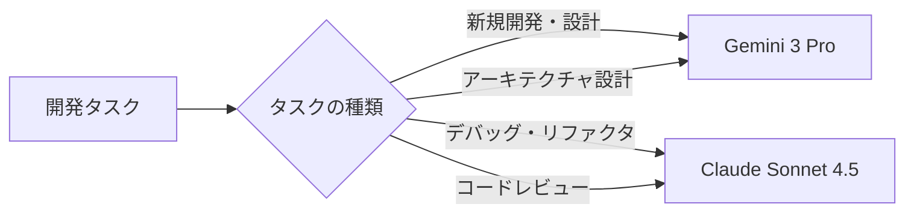
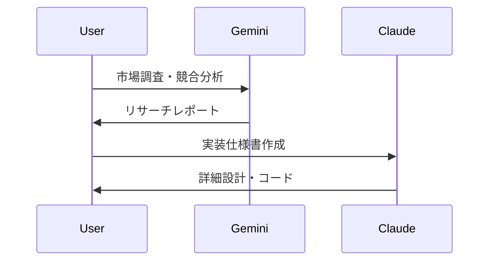

# Gemini × Claude 使い分けガイド

!!! note "2026年版比較"
    2025年末〜2026年初頭の最新情報に基づく実用的な使い分けガイドです。

## 📊 特徴比較

### Gemini 3 Pro の強み

!!! success "Geminiが優れる領域"
    - **🔍 リサーチ・分析**: 最新の検索機能とGoogle統合
    - **📊 マルチモーダル**: 画像・動画・音声処理が得意
    - **💾 長文処理**: 100万〜200万トークンの圧倒的なコンテキストウィンドウ
    - **💰 コスト効率**: API利用が20倍安価（Claude比）
    - **🔧 Google統合**: Workspace、NotebookLM、検索との連携
    - **⚡ スピード**: 高速レスポンス

### Claude Sonnet 4.5 の強み

!!! success "Claudeが優れる領域"
    - **💻 コーディング**: SWE-bench 77.2%の実用的プログラミング
    - **📝 創作・執筆**: 文章品質と一貫性
    - **🤔 推論・思考**: 深い論理的思考プロセス
    - **🛠️ エージェント動作**: 自律的なタスク実行
    - **📋 指示遵守**: 正確な要求理解と実行
    - **🔒 信頼性**: 安定した出力品質

## 🎯 タスク別推奨

### コーディング・開発



!!! tip "開発での使い分け"
    - **新規プロジェクト設計**: Gemini（リサーチ力・アイデア出し）
    - **実装・デバッグ**: Claude（正確性・コード品質）
    - **ドキュメント作成**: 長文→Gemini、技術文書→Claude

### 執筆・創作

!!! example "シナリオ別選択"
    - **📚 長編小説・レポート**: Gemini（長文コンテキスト）
    - **✍️ ビジネス文書**: Claude（構造化・論理性）
    - **🎨 創作アイデア**: Gemini（発想力・多角的視点）
    - **📖 編集・校正**: Claude（一貫性・品質管理）

### 分析・リサーチ

```yaml
データ分析: 
  - 大量データ処理: Gemini (長文コンテキスト)
  - 統計解析: Claude (論理的思考)

市場調査:
  - 最新トレンド: Gemini (検索統合)
  - 競合分析: Claude (構造化分析)

学術研究:
  - 文献レビュー: Gemini (100万トークンで大量論文)
  - 論文執筆: Claude (論理構成・引用管理)
```

### マルチモーダル処理

!!! success "Geminiの独壇場"
    - **画像解析**: 写真、図表、グラフの詳細分析
    - **動画処理**: 長時間動画の内容理解
    - **音声処理**: 音声ファイルの文字起こし・分析
    - **複合メディア**: テキスト+画像+音声の統合処理

## 💰 料金比較（2025-2026年版）

### サブスクリプション

| プラン | Gemini | Claude | 備考 |
|--------|---------|---------|------|
| 無料 | ✅ 制限あり | ✅ 日次上限 | Geminiは検索・YouTube統合 |
| 基本 | $19.99/月 | $20/月 | Gemini: 2TB Google One付き |
| 上位 | - | $100/月 (5倍) | Claude Pro Max |
| 最上位 | - | $200/月 (20倍) | Claude Max Ultra |

### API利用

!!! warning "コスト差に注意"
    **Gemini APIはClaude APIより約20倍安価**
    
    - **Gemini Flash**: $0.15-3.50/M トークン
    - **Claude Sonnet**: $3/M トークン（入力）
    - **高頻度利用ではGeminiが圧倒的に有利**

## 🌟 Gemini独自の強み

### Google Workspace統合

!!! tip "実用的な連携例"
    ```bash
    # Gmail分析
    "過去1ヶ月の重要メールを要約して"
    
    # Google Drive検索
    "プロジェクト資料から予算関連を抽出"
    
    # Google カレンダー
    "来週の予定を考慮してタスク優先度を提案"
    ```

### NotebookLM活用

```python
# NotebookLM + Gemini ワークフロー
sources = [
    "research_papers/",
    "meeting_notes/", 
    "project_docs/"
]

# 1. NotebookLMで知識ベース構築
notebook = create_notebook(sources)

# 2. Geminiで100万トークン分析
analysis = gemini.analyze_with_context(
    query="競合他社の戦略パターンを抽出",
    context_size="1M_tokens"
)

# 3. 統合レポート生成
report = notebook.generate_report(analysis)
```

### 超長文処理（100万-200万トークン）

!!! example "活用シナリオ"
    - **📚 書籍全体の分析**: 小説・技術書の包括的レビュー
    - **📊 大規模データセット**: CSVファイル・ログ分析
    - **📝 長期プロジェクト**: 数ヶ月分の議事録・進捗統合
    - **🔍 法的文書**: 契約書・規約の詳細検証

## 🔄 連携ワークフロー例

### パターン1: 調査→実装



### パターン2: アイデア→実現

!!! example "創作プロジェクト"
    1. **Gemini**: ブレインストーミング・アイデア発散
    2. **Claude**: 構成整理・詳細プロット作成
    3. **Gemini**: 長編執筆（100万トークンコンテキスト）
    4. **Claude**: 校正・品質向上

### パターン3: 分析→報告

```yaml
データ分析ワークフロー:
  収集: Gemini (検索・Workspace連携)
  処理: Claude (構造化・論理分析) 
  可視化: Gemini (画像生成・チャート)
  報告: Claude (ビジネス文書作成)
```

## 🎪 実践的な選択基準

### 迷った時のチェックリスト

!!! question "どちらを選ぶ？"
    - [ ] **大量のデータ処理が必要** → Gemini
    - [ ] **正確な実装・実行が必要** → Claude  
    - [ ] **最新情報の調査が必要** → Gemini
    - [ ] **論理的な推論が必要** → Claude
    - [ ] **画像・動画・音声処理** → Gemini
    - [ ] **コーディング・デバッグ** → Claude
    - [ ] **コストを抑えたい** → Gemini
    - [ ] **品質・信頼性重視** → Claude

### プロジェクトフェーズ別

| フェーズ | 推奨AI | 理由 |
|---------|---------|------|
| 🔍 企画・調査 | **Gemini** | リサーチ力・発想力 |
| 📐 設計・仕様 | **Claude** | 論理性・構造化 |
| ⚡ 実装・開発 | **Claude** | コーディング精度 |
| 🧪 テスト・検証 | **Claude** | デバッグ・品質管理 |
| 📊 分析・改善 | **Gemini** | データ分析・洞察 |
| 📝 ドキュメント | **両方** | 用途により使い分け |

## 🚀 今後の展望

!!! info "2026年の注目ポイント"
    - **Gemini 3 Ultra**: さらなる性能向上予定
    - **Claude Opus 4**: 創作・推論のブレイクスルー
    - **API価格競争**: より低コスト化の可能性
    - **マルチモーダル進化**: 動画・3D・ARサポート拡大

## 💡 まとめ

!!! success "最適な使い分け戦略"
    **単体利用よりも組み合わせが最強**
    
    - **Gemini**: 発散思考・大量処理・コスト効率
    - **Claude**: 収束思考・精密作業・品質保証
    - **連携**: 各AIの強みを活かしたハイブリッド活用
    
    プロジェクトの性質と予算に応じて、適材適所で使い分けることで、AIの真の力を引き出せます。

---

!!! tip "関連ガイド"
    - [Gemini モード活用](modes.md)
    - [API活用](api.md) 
    - [Workspace連携](workspace.md)
    - [NotebookLM](notebooklm.md)