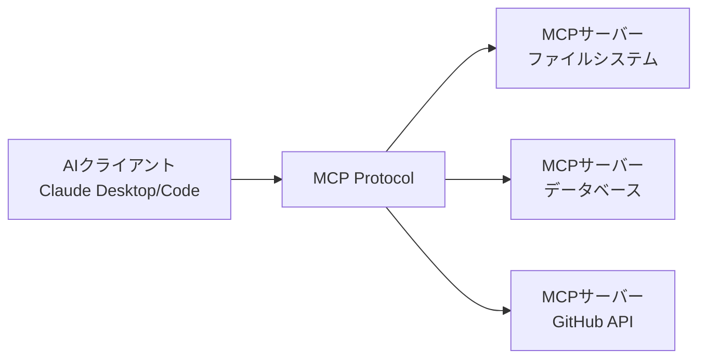

# MCP (Model Context Protocol) まとめ

!!! info "MCP とは"
    MCP (Model Context Protocol) は、AIアシスタントがデータソース、ビジネスツール、開発環境などの外部システムと安全に接続するためのオープンスタンダードです。

## MCPとは何か

Model Context Protocol (MCP) は、2024年にAnthropic社がオープンソースとして公開した新しいプロトコルです。AIモデルが外部リソースとやり取りするための標準化されたフレームワークを提供し、AI統合の複雑さを大幅に軽減します。

### 従来の問題

- **カスタム統合の乱立**: 各ツールやサービスが独自のAI統合を開発
- **セキュリティの課題**: 統一されたセキュリティ標準の欠如
- **保守性の低さ**: 統合ごとに異なる実装とメンテナンス負荷

### MCPが解決すること

- **標準化**: 統一されたプロトコルによる一貫性のある統合
- **セキュリティ**: 安全なAIシステム間通信の確立
- **スケーラビリティ**: 新しいデータソースやツールとの簡単な接続

## MCPの仕組み

MCPは**クライアント/サーバー**アーキテクチャを採用しています。

### 基本構成



### 主要コンポーネント

#### 1. **ツール (Tools)**
外部システムとの具体的な操作を定義します。

!!! example "ツールの例"
    ```json
    {
      "name": "read_file",
      "description": "ファイルの内容を読み取ります",
      "inputSchema": {
        "type": "object",
        "properties": {
          "path": {"type": "string"}
        }
      }
    }
    ```

#### 2. **リソース (Resources)**
AIモデルがアクセスできる情報や文書を表現します。

!!! example "リソースの例"
    ```json
    {
      "uri": "file:///home/user/document.txt",
      "name": "重要な文書",
      "description": "プロジェクトの仕様書",
      "mimeType": "text/plain"
    }
    ```

#### 3. **プロンプト (Prompts)**
特定のコンテキストでAIに渡す定型的な指示やテンプレートです。

!!! example "プロンプトの例"
    ```json
    {
      "name": "code_review",
      "description": "コードレビュー用プロンプト",
      "arguments": {
        "language": {"type": "string"},
        "code": {"type": "string"}
      }
    }
    ```

## なぜMCPが重要か

### 1. **開発効率の向上**

従来はツールごとに個別のプラグインやAPIが必要でしたが、MCPにより標準化されたインターフェースで統合できます。

!!! success "開発効率化のメリット"
    - **単一のプロトコル**で複数のサービスと連携
    - **既存のMCPサーバー**をすぐに利用可能
    - **学習コスト**の大幅削減

### 2. **エコシステムの拡大**

MCPの標準化により、AIツールエコシステムが急速に拡大しています。

!!! info "2025年現在の状況"
    - **7,260以上**のMCPサーバーが利用可能
    - **Linux Foundation**がAgentic AI Foundation (AAIF) を設立
    - 主要企業（Microsoft、Google等）がMCP対応を進行中

### 3. **セキュリティ強化**

MCPは安全なAI統合のためのセキュリティ機能を内蔵しています。

!!! warning "セキュリティ機能"
    - **認証・認可**の標準化
    - **権限管理**の統一
    - **データ分離**とプライバシー保護

### 4. **将来性**

MCPはAI業界の標準プロトコルとして広く採用が進んでいます。

!!! tip "将来への投資"
    MCPを学習・導入することで、将来のAI技術進歩に対応可能な基盤を構築できます。

## MCPの活用例

### ビジネス分野
- **CRMシステム**との連携
- **会計ソフト**の自動操作
- **プロジェクト管理**ツールとの統合

### 開発分野
- **GitHub/GitLab**での自動コードレビュー
- **データベース**の自然言語クエリ
- **CI/CD**パイプラインの自動化

### 個人利用
- **ファイル管理**の自動化
- **Webスクレイピング**
- **通知システム**の構築

## 次のステップ

1. **[おすすめMCPサーバー](servers.md)** - 利用可能なサーバー一覧
2. **[セットアップ手順](setup.md)** - 具体的な導入方法
3. **[実用例](use-cases.md)** - 実際の活用パターン

---

!!! note "参考リンク"
    - [Anthropic公式発表](https://www.anthropic.com/news/model-context-protocol)
    - [MCP公式ドキュメント](https://modelcontextprotocol.io/)
    - [GitHub公式リポジトリ](https://github.com/modelcontextprotocol)